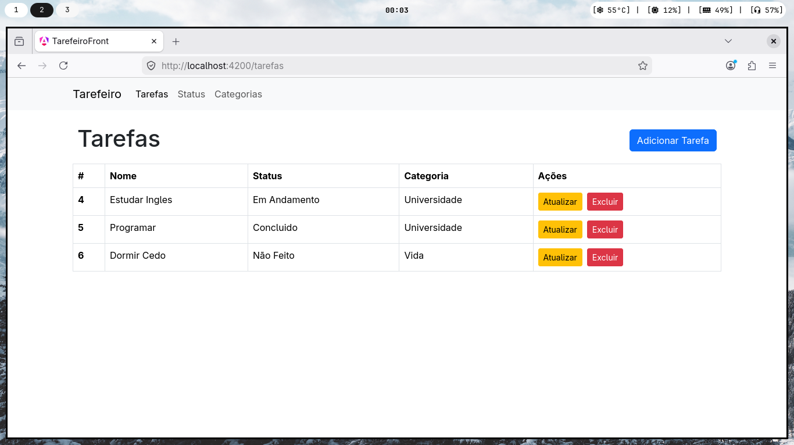

# Tarefeiro - Gerenciador de Tarefas

O **Tarefeiro** é uma aplicação Full Stack projetada para o gerenciamento dinâmico de tarefas, permitindo o controle completo de ciclos de vida de atividades, categorização e monitoramento de status. O projeto foi feito para fins de aprendizagem sobre aplicações Full Stack utilizando Angular no Front e .NET C# no Back.

---

## Arquitetura e Tecnologias

A aplicação foi estruturada para separar claramente as preocupações entre a interface de usuário e a lógica de persistência.

### Backend (C# / .NET)
A API foi desenvolvida seguindo os princípios da **Clean Architecture**, garantindo que a lógica de negócio seja independente de frameworks externos e detalhes de infraestrutura.

* **Entity Framework Core:** Utilizado para a persistência de dados com abordagem Code-First.
* **MySQL:** Banco de dados relacional para armazenamento seguro das informações.
* **AutoMapper:** Implementado para realizar o mapping entre Entidades de domínio e DTOs (Data Transfer Objects), evitando a exposição direta do modelo de dados e reduzindo o boilerplate code.
* **Boas Práticas:** Aplicação de Injeção de Dependência nativa, tratamento de exceções estruturado e padrões de repositório para isolar o acesso a dados.

### Frontend (Angular)
Interface SPA (Single Page Application) focada em uma experiência de usuário fluida:

* **Angular 17+:** Utilização de componentes modulares, serviços para consumo de APIs REST e tipagem forte com TypeScript.
* **Gerenciamento de Estado:** Fluxo de dados consistente para operações de listagem e sincronização de formulários.

---

## Estrutura do Projeto (Clean Architecture)

O backend está organizado nas seguintes camadas:

1.  **Domain:** Contém as entidades e interface dos repositórios.
2.  **Application:** Onde residem os DTOs, Mappers e Casos de Uso.
3.  **Infrastructure:** Implementação técnica da persistência de dados (Contexto do Banco e Repositórios).
4.  **Presentation:** Camada de entrada com Controllers, configuração de middlewares e documentação de endpoints.

---

## Funcionalidades

* **Gestão de Tarefas:** CRUD completo (Criar, Ler, Atualizar e Excluir).
* **Controle de Status:** Monitoramento do progresso (Ex: Não Feito, Em Andamento, Concluído).
* **Categorização:** Organização por contextos como Universidade, Vida Pessoal ou Trabalho.
* **Interface Limpa:** Foco em usabilidade e visualização rápida das pendências.

---

## Demonstração

---

## Como Executar

### Pré-requisitos
* .NET SDK (8.0+)
* Node.js e pnpm
* MySQL/MariaDB

### Passo a Passo
1.  **Banco de Dados:** Configure a string de conexão no `appsettings.json` e execute `dotnet ef database update`.
2.  **Backend:** Na pasta raiz do servidor, execute `dotnet run`.
3.  **Frontend:** Na pasta do cliente, execute `pnpm install` seguido de `ng serve`.
4.  **Acesso:** Navegue até `http://localhost:4200`.